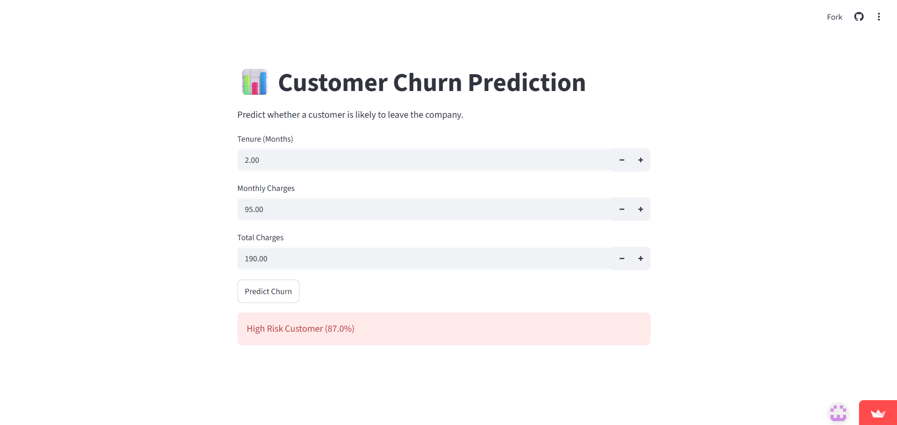
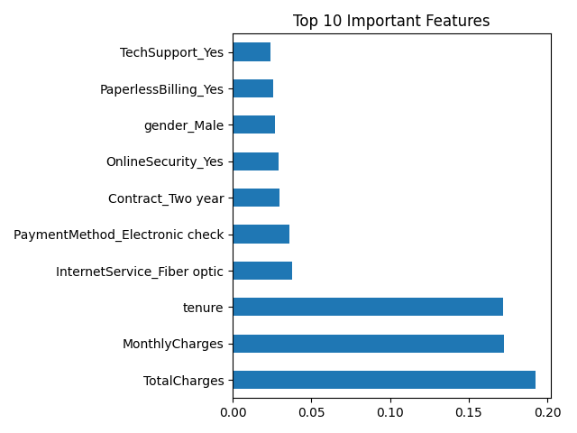
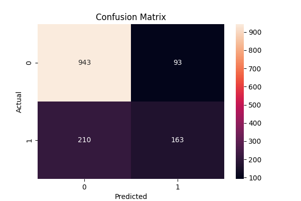

# Customer Churn Prediction using Machine Learning

## Live Demo

🌐 Streamlit App:

<https://customer-churn-prediction-ml-fkr6kauxknv2rrb5tprsvz.streamlit.app/>

## GitHub Repository

<https://github.com/keshav323/customer-churn-prediction-ml>

---

## Project Overview

This project predicts whether a customer is likely to discontinue a company's service using Machine Learning techniques.

### Technologies Used

- Python
- Pandas
- NumPy
- Scikit-Learn
- Streamlit
- Matplotlib
- Seaborn
- Joblib

### Machine Learning Model

- Random Forest Classifier
- Accuracy: ~77%

---

## Dashboard

---

## Feature Importance

---

## Confusion Matrix

---

## Features

- Data Cleaning
- Exploratory Data Analysis
- Feature Engineering
- Random Forest Classification
- Churn Prediction
- Probability-Based Risk Assessment
- Streamlit Deployment

---

## Author

Keshav Saini
